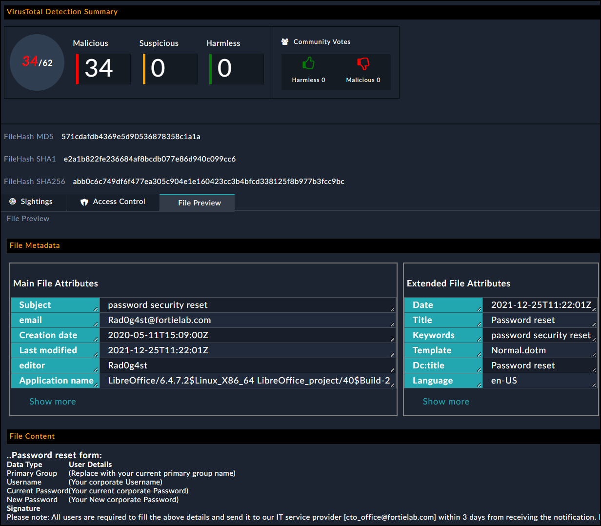

# About the connector

The connector uses is used to extract content, metadata and artifacts from over 1500 file types such as MS Office, PDF...etc

# Version information

Connector Version: 1.0.2

FortiSOAR™ Version Tested on: 7.2.0

Authored By: Fortinet CSE

Certified: No

# Installing the connector

From FortiSOAR™ 5.0.0 onwards, use the Connector Store to install the connector. For the detailed procedure to install a connector, click [here](https://docs.fortinet.com/document/fortisoar/0.0.0/installing-a-connector/1/installing-a-connector).
You can also use the following yum command as a root user to install connectors from an SSH session:

`yum install cyops-connector-file-content-extraction`


# Prerequisites to configuring the connector

- The connector requires python tika which should be installed automatically with the RPM package, if you deploy the connector  from tarball via the WebUI it is mandatory to run:

bash
```sudo -u nginx /opt/cyops-integrations/.env/bin/pip install -r /opt/cyops-integrations/integrations/connectors/file-content-extraction_1_0_0/requirements.txt```

- The connectors module should have an HTML field named `filePreview` to store the extracted data. If the field does not exist, extracted data will be added to the `Description` field (Optional)
- If the field `filePreview` is created, it is usually added to the view template as a TAB (Optional)
- The above customizations and more are available in the [File Content Extraction solution pack](https://github.com/fortinet-fortisoar/solution-pack-file-content-extraction)

# Configuration parameters

The connector requires no configuration

# Actions supported by the connector

The following automated operations can be included in playbooks
|Function|Description|
|:--|:--|
|Extract Text|Extract Text and Metadata from file|
|Extract Artifacts|Extract Artifacts From File|
|Get Backend Config|Get Extraction Backend Configuration Details|


### Note:

The connector includes the playbook: `Extract and Process Text From File` which can be used with any file indicator to extract its content, metadata and artifacts as illustrated in the screenshot below:



The Extraction should also work on `Attachments` for the input parameter is the file IRI

# Change log:
- 1.0.2:
    - Moved Tika jar/md5 to `/opt/cyops-integrations/integrations/workspace/file-content-extraction/` to support 7.2 new connector architecture